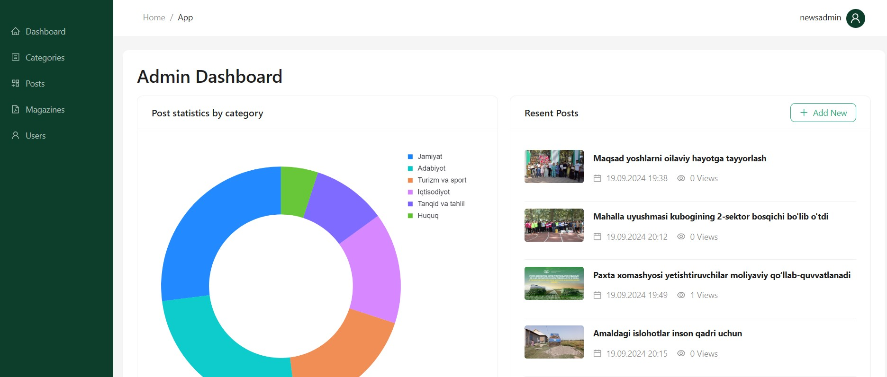

# Full-stack newspaper application

## Description

**The application consists of two parts:**
 - **Frontend:** User interface for Admin! Admin can control articles and magazines.
 - **Backend:** Newspaper REST Service! `Users` can create, read, update, delete data about `Posts`, `Categories` and `Magazines` in their own Newspaper Service!

## Production

**Live links:** 
 - Admin UI: [https://uzunpro.uz/](https://uzunpro.uz/)
 - API: [https://uzunpro.uz/api/](https://uzunpro.uz/api/)

## Installation

1. Clone the repository: `git clone <repository-url>`
2. Go to `develop` branch
3. Install the required dependencies by running `npm install`
4. Containerization - docker compose: `npm run backend:docker:compose:up`
5. Put environment variables to `.env` file to both `frontend` and `backend`. You can freely change `.env.example`

## Technologies Used

- React, Ant Design, React Query, Eslint
- Node.js, Nestjs, Swagger, Prisma, Postgresql, Docker
- CD/CI - Github Actions

## Usage

1. Application is used monorepo feature that contains two `frontend` and `backend` workspace.

2. Start running one of the commands:

	- Backend: `npm run backend:start`
	- Frontend: `npm run frontend:start`
	- Both: `npm run start`

2. App UI on the `BASE_URL/` and access to the API on `BASE_URL/api` endpoint.

3. The API documented by Swagger (OpenAPI) on `/api/docs` endpoint.

## Prisma & migrations

 - Generate migration: `npm -w backend run prisma:migration:dev` 
 - Running migration: `npm -w backend run prisma:migration:deploy` 
 - Prisma studio: `npm run backend:prisma:studio` 

## Admin API Endpoints

#### Category
* `GET /admin/category` - get all categories.
* `GET /admin/category/:id` - get single category by id
* `POST /admin/category` - create category
* `PUT /admin/category/:id` - update category
* `DELETE /admin/category/:id` - delete category

#### Post
* `GET /admin/post` - get all posts.
* `GET /admin/post/:id` - get single post by id
* `POST /admin/post` - create post
* `PUT /admin/post/:id` - update post
* `DELETE /admin/post/:id` - delete post

#### Post Image
* `GET /media/images/:imagename` - get image source by url
* `POST /upload/image` - create post image

#### Magazine
* `GET /admin/magazine` - get all magazines.
* `GET /admin/magazine/:id` - get single magazine by id
* `POST /admin/magazine` - create magazine
* `PUT /admin/magazine/:id` - update magazine
* `DELETE /admin/magazine/:id` - delete magazine

## Public API Endpoints

#### Categories
* `GET /categories` - get all categories.
* `GET /categories/:slug` - get single category by slug
* `GET /categories/:slug/posts` - get all posts related to category

#### Posts
* `GET /posts` - get all posts.
* `GET /posts/:slug` - get single post by slug
* `GET /posts/featured_posts` - get all featured posts
* `GET /posts/actual_posts` - get all actual posts
* `GET /posts/related_posts` - get all posts related to the current post

#### Posts
* `GET /magazines` - get all magazines.
* `GET /magazines/:id` - get single magazine by id
* `GET /magazines/:id/download` - download magazine file and increment downloadsCount
* `GET /media/magazines/:filename` - view magazine pdf file on the browser

